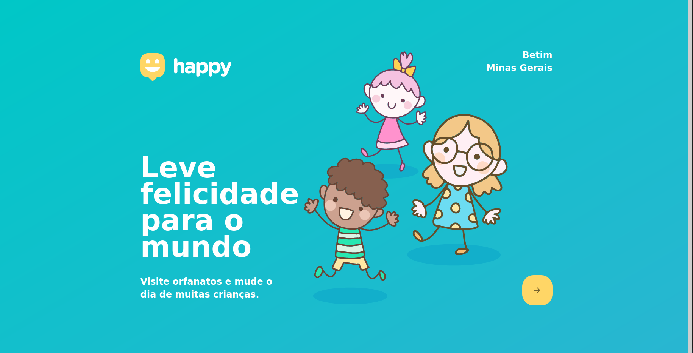
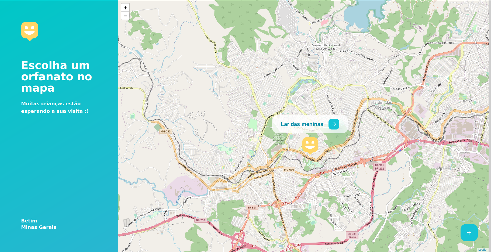
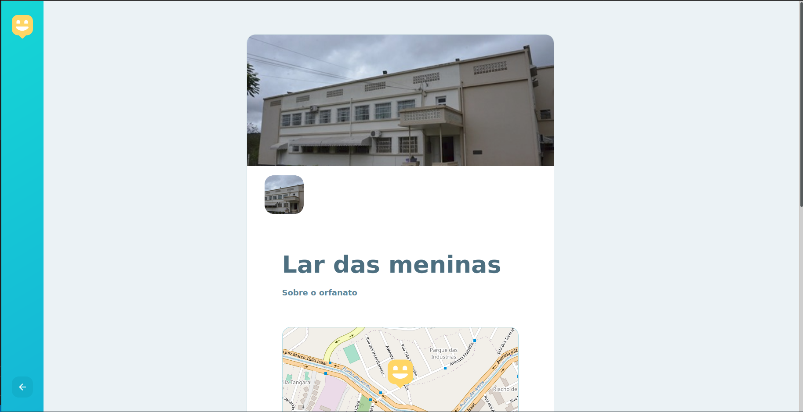
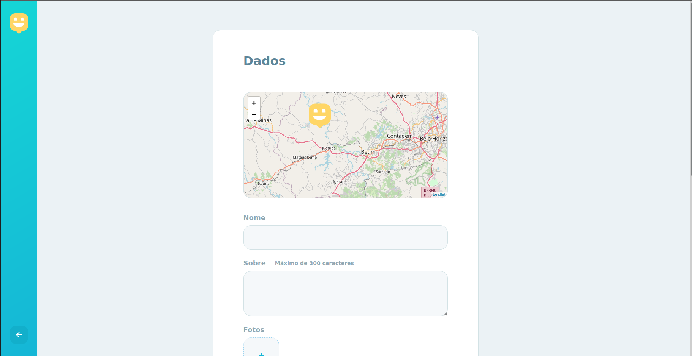

# Happy! web app

Hello, welcome to the Happy! web app.

---

## Observations

- The contact button hasn't been implemented.

## Build instructions

1. You just need to run: `yarn build` or if you are using npm: `npm run build`

## Run instructions

If you just want to run the project, just run: `yarn serve` and the app will be
serving in port 8080
