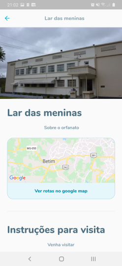
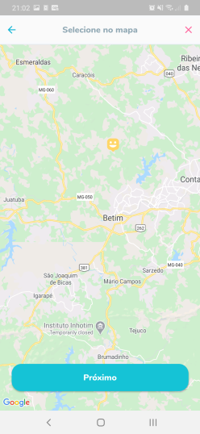
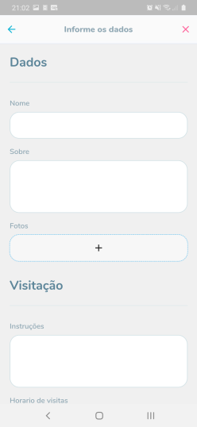

# Happy! mobile app

Hello, welcome to the Happy! mobile app.

---

## Observations

- This project was only setup for android, if you want to use it in iOS you will
  need to setup the google maps api key there,
  and the App Icon

- The contact button and the google map routes button hasn't been implemented.

## Build instructions

1. You need to run: `flutter pub get`
2. Then need to [setup android project](https://github.com/LorenzooG/happy-nlw/tree/main/mobile/android)
3. Then need to run: `flutter build apk --debug`
4. Then need to run: `flutter build apk --dart-define=API_URL=***your-backend-url***`

- Your app build can be found in: mobile/build/app/outputs/flutter-apk/app-release.apk

## Run instructions

If you just want to run the project, follow the phases above, just change the flutter build commands
by `flutter run`

- You will need a emulator or a device setup
